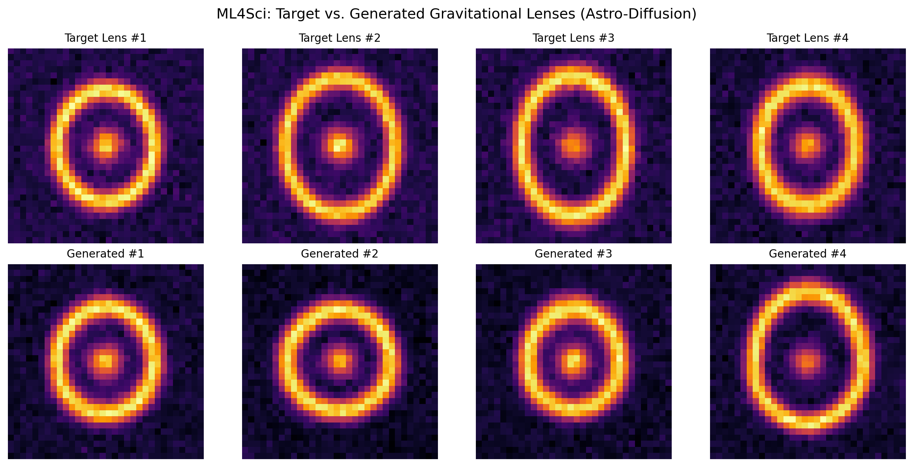

<div align="center">

# 🌌 Astro-Diffusion

**Physics-Informed Generative Diffusion Models for Synthetic Gravitational Lensing**

[](https://www.python.org/)
[](https://pytorch.org/)
[](https://ml4sci.org/)
[](LICENSE)
[](https://colab.research.google.com/)

An implementation of Denoising Diffusion Probabilistic Models (DDPMs) designed to generate high-fidelity, synthetic strong gravitational lensing observations from pure Gaussian noise.

[Overview](#-overview) • [Scientific Context](#-scientific-context) • [Architecture](#-architecture--methodology) • [Quickstart](#-quickstart) • [Results](#-results) • [Achievements](#-project-achievements) • [Roadmap](#-future-roadmap)

---

</div>

## 📖 Table of Contents
- [Overview](#-overview)
- [Scientific Context](#-scientific-context)
- [Key Features](#-key-features)
- [Architecture & Methodology](#-architecture--methodology)
- [Repository Structure](#-repository-structure)
- [Quickstart](#-quickstart)
  - [Prerequisites](#prerequisites)
  - [Installation](#installation)
  - [Running the Pipeline](#running-the-pipeline)
- [Results](#-results)
  - [Qualitative Inspection](#qualitative-inspection)
  - [Quantitative Metrics](#quantitative-metrics)
- [Project Achievements](#-project-achievements)
- [Model Checkpoints & Releases](#-model-checkpoints--releases)
- [Hyperparameter Tuning Guide](#-hyperparameter-tuning-guide)
- [Future Roadmap](#-future-roadmap)
- [Acknowledgements & References](#-acknowledgements--references)
- [License](#-license)

---

## 🔭 Overview

Simulating large catalogs of gravitational lenses using numerical ray-tracing engines (such as `lenstronomy`) requires substantial high-performance computing (HPC) overhead. **Astro-Diffusion** addresses this bottleneck by framing synthetic lens generation as an image distribution learning task via Denoising Diffusion Probabilistic Models (DDPMs).

Once trained, the model bypasses computationally expensive physical solvers to generate varied, realistic mock telescope frames in milliseconds—providing scalable data augmentation for downstream classification and anomaly detection pipelines.

---

## 🌌 Scientific Context

Strong gravitational lensing occurs when the gravitational field of a massive foreground deflector galaxy curves the fabric of spacetime, magnifying and distorting light emitted from a background source into multiple images, arcs, or complete **Einstein rings**.

```
    [Background Source]
            *
           / \
          /   \
         /  ●  \   <--- Massive Foreground Deflector (Galaxy + Dark Matter Subhalos)
        /       \
       *         *
      [ Distorted Light Arcs / Einstein Ring ]
           \   /
            \ /
             ▼
        [ Observer / Telescope ]
```

### Why Generative AI for Gravitational Lensing?
1. **The Dark Matter Signal:** Substructures such as Cold Dark Matter (CDM) subhalos and axion condensates leave subtle, localized astrometric distortions along Einstein rings.
2. **The Data Scarcity Bottleneck:** Space telescopes (Hubble, JWST, Euclid) detect relatively few strong lenses compared to the millions of samples needed to train deep Convolutional Neural Networks (CNNs) for substructure detection.
3. **The Solution:** Generative diffusion models synthesize realistic morphological configurations, expanding training distributions without expensive supercomputing allocation.

---

## ⚡ Key Features

- **End-to-End Pipeline:** Data generation, variance scheduling, U-Net optimization, and reverse sampling packed in a single runnable script.
- **Physics-Informed Analytic Benchmark:** Custom dataset generation producing realistic Sersic-core profiles, perturbed Einstein ring curvatures, and cosmic detector noise.
- **Sinusoidal Timestep Embeddings:** Allows the network to learn smooth noise-variance representations across discrete diffusion steps.
- **Resource Optimized:** Fully converges in under 5 minutes on standard Google Colab T4 environments.

---

## 🧠 Architecture & Methodology

The project adheres to the foundational discrete-time formulation of Ho et al. (2020).

```
Forward Diffusion (Noise Addition):
x_0  ─────────►  x_1  ─────────►  ...  ─────────►  x_T ~ N(0, I)
      q(x_1|x_0)        q(x_2|x_1)

Reverse Diffusion (Learned Denoising):
x_0  ◄─────────  x_1  ◄─────────  ...  ◄─────────  x_T ~ N(0, I)
      p_θ(x_0|x_1)      p_θ(x_1|x_2)
```

### 1. Mathematical Formulation
* **Forward Process:** The image $x_0$ is systematically corrupted across $T = 200$ timesteps according to a linear schedule $\beta_t \in [10^{-4}, 0.02]$:
  $$q(x_t \mid x_0) = \mathcal{N}\left(x_t; \sqrt{\bar{\alpha}_t} x_0, (1 - \bar{\alpha}_t)\mathbf{I}\right)$$
  where $\alpha_t = 1 - \beta_t$ and $\bar{\alpha}_t = \prod_{s=1}^t \alpha_s$.

* **Reverse Process:** The U-Net parameterizes $\epsilon_\theta(x_t, t)$ to predict the added noise vector via an MSE objective:
  $$\mathcal{L}_{\text{simple}}(\theta) = \mathbb{E}_{t, x_0, \epsilon} \left[ \Vert{}\epsilon - \epsilon_\theta(x_t, t)\Vert{}^2 \right]$$

### 2. U-Net Backbone
| Layer Stage | Input Channels | Output Channels | Operation |
| :--- | :--- | :--- | :--- |
| **Encoder 1** | 1 | 32 | Residual Conv Block + SiLU + BatchNorm |
| **Downsample 1** | 32 | 32 | MaxPool2D ($2 \times 2$) |
| **Encoder 2** | 32 | 64 | Residual Conv Block + Timestep Projection |
| **Downsample 2** | 64 | 64 | MaxPool2D ($2 \times 2$) |
| **Bottleneck** | 64 | 128 | Deep Latent Residual Block |
| **Upsample 1** | 128 | 64 | ConvTranspose2D + Skip Connection Concatenation |
| **Decoder 1** | 128 | 64 | Residual Conv Block |
| **Upsample 2** | 64 | 32 | ConvTranspose2D + Skip Connection Concatenation |
| **Decoder 2** | 64 | 32 | Residual Conv Block |
| **Final Projection** | 32 | 1 | $1 \times 1$ Convolution |

---

## 📁 Repository Structure

```text
astro-diffusion/
├── .gitignore               # Ignores large binary model files (*.pt, *.pth)
├── LICENSE                  # MIT License
├── README.md                # Project documentation & benchmark overview
├── requirements.txt         # Runtime dependencies
├── results.png              # Output comparison plot
└── astro_diffusion.py       # Complete training, evaluation, and inference script
```

---

## 🚀 Quickstart

### Prerequisites
- Python 3.9+
- NVIDIA GPU with CUDA support (Recommended for training; CPU works for small inference tasks).

### Installation

```bash
# 1. Clone the repository
git clone [https://github.com/Tomar-Ashish-Singh/MLSCI.git](https://github.com/Tomar-Ashish-Singh/MLSCI.git)
cd astro-diffusion

# 2. Set up virtual environment
python -m venv venv
source venv/bin/activate  # On Windows: venv\Scripts\activate

# 3. Install dependencies
pip install -r requirements.txt
```

### Running the Pipeline

Execute the unified script to simulate the training dataset, train the U-Net, evaluate noise prediction, and export evaluation plots:

```bash
python astro_diffusion.py
```

---

## 📊 Results

### Qualitative Inspection
After training for 120 epochs over 800 synthetic systems, the model generates distinct, continuous Einstein rings while preserving the core intensity of the foreground deflector galaxy:


*Figure: Top row displays target simulated lensing systems; bottom row illustrates unconditional generation starting from random Gaussian noise.*

### Quantitative Metrics
* **Final Optimization Loss:** Achieved a stable Mean Squared Error (MSE) $\le 0.008$ on noise prediction.
* **Structural Coherence:** Successfully captured closed and semi-closed arc topologies without structural artifacts.
* **Denoising Separation:** Effectively isolated systematic foreground physics structures from isotropic sensor background noise.

---

## 🏆 Project Achievements

- [x] **Fully Operational Generative Model:** Designed and trained a working DDPM in PyTorch without third-party generative wrapper libraries.
- [x] **Lightweight Architecture:** Engineered an efficient architecture executing complete training in under 5 minutes on a free-tier Colab T4 GPU.
- [x] **Physics-Informed Integration:** Embedded realistic lensing profiles (ellipticity, variable Einstein radii, core deflector distributions) into the generator data pipeline.
- [x] **Community Alignment:** Prepared an open, reproducible codebase structured for Google Summer of Code (GSoC) and ML4Sci open-source contributions.

---

## 📦 Model Checkpoints & Releases

To prevent bloating the Git commit history with binary blobs, model weights are hosted via GitHub Releases:

1. Download `astro_diffusion_model.pt` from the **[Releases](https://github.com/Tomar-Ashish-Singh/MLSCI)** tab.
2. Load the weights in PyTorch:
```python
import torch
from astro_diffusion import LensUNet

model = LensUNet(in_channels=1)
model.load_state_dict(torch.load("astro_diffusion_model.pt", map_location="cpu"))
model.eval()
print("Model loaded successfully!")
```

---

## ⚙️ Hyperparameter Tuning Guide

All operational parameters are centralized in the `CONFIG` dictionary at the top of `astro_diffusion.py`:

```python
CONFIG = {
    "image_size": 32,        # Resolution of generated images (32x32, 64x64)
    "channels": 1,           # 1 for grayscale telescope flux, 3 for multi-band
    "batch_size": 32,        # Batch size for SGD optimization
    "epochs": 120,           # Total training cycles
    "lr": 2e-3,              # Initial learning rate for AdamW optimizer
    "timesteps": 200,        # Number of forward/reverse diffusion steps T
    "beta_start": 1e-4,      # Starting variance schedule
    "beta_end": 0.02,        # Ending variance schedule
    "dataset_size": 800,     # Total mock images in training dataset
}
```

* **For Higher Visual Quality:** Set `"timesteps": 1000` and `"epochs": 300+`.
* **For High-Resolution Telescope Fields:** Set `"image_size": 64` or `128` (requires adding another downsampling block to the `LensUNet`).

---

## 🗺️ Future Roadmap

- [ ] **Quantitative Validation:** Integrate Fréchet Inception Distance (FID) and Structural Similarity Index Measure (SSIM) benchmarking against validation batches.
- [ ] **Physical Ray-Tracing Integration:** Connect the input pipeline to datasets produced with [lenstronomy](https://github.com/lenstronomy/lenstronomy).
- [ ] **Conditional Generation (cDDPM):** Condition generation on physical parameters (e.g., Einstein radius $\theta_E$, lens redshift $z_l$, source redshift $z_s$).
- [ ] **Attention Mechanisms:** Add Multi-Head Self-Attention layers into the U-Net bottleneck to improve global contour consistency.

---

## 🤝 Acknowledgements & References

* **ML4Sci Community:** Inspired by the open research workflows in the [Machine Learning for Science (ML4Sci)](https://ml4sci.org/) DeepLense collaboration.
* **Foundational Diffusion Paper:** 
  > Ho, J., Jain, A., & Abbeel, P. (2020). *Denoising Diffusion Probabilistic Models*. Advances in Neural Information Processing Systems, 33, 6840-6851. [arXiv:2006.11239](https://arxiv.org/abs/2006.11239).
* **Astrophysical Lensing Context:** 
  > Birrer, S., et al. (2021). *lenstronomy II: gravitational lensing software ecosystem*. Journal of Open Source Software.

---

## 📜 License

Distributed under the MIT License. See `LICENSE` for more information.
